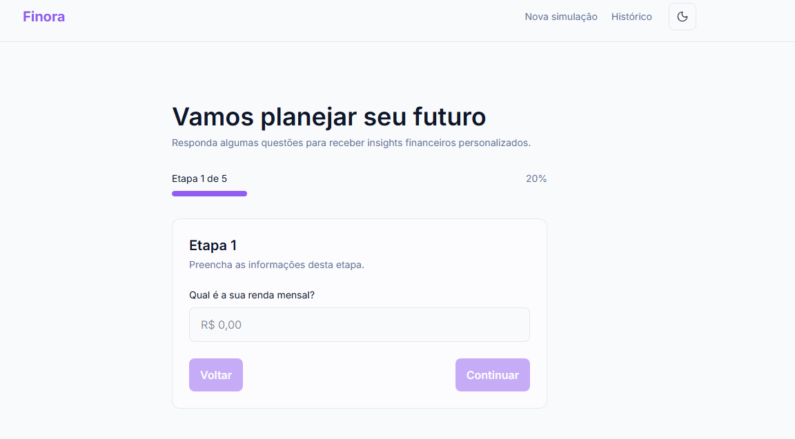
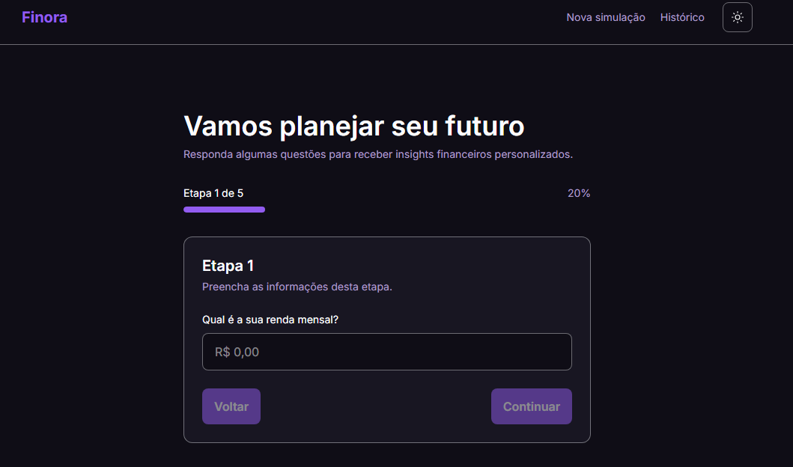
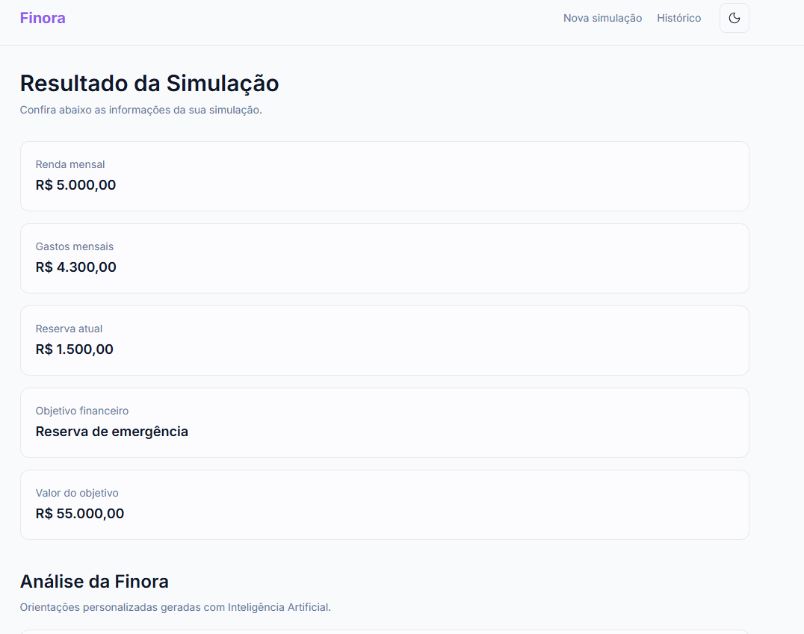
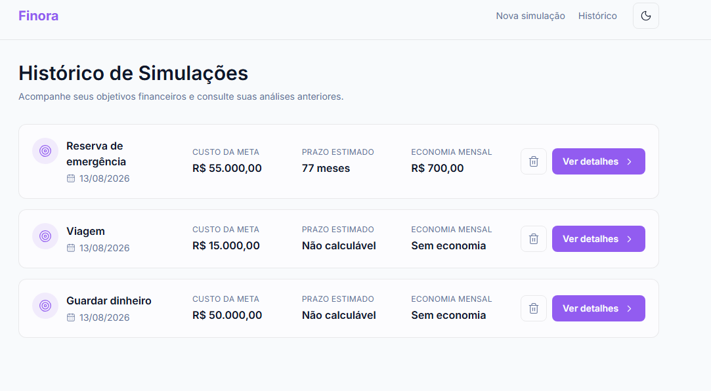
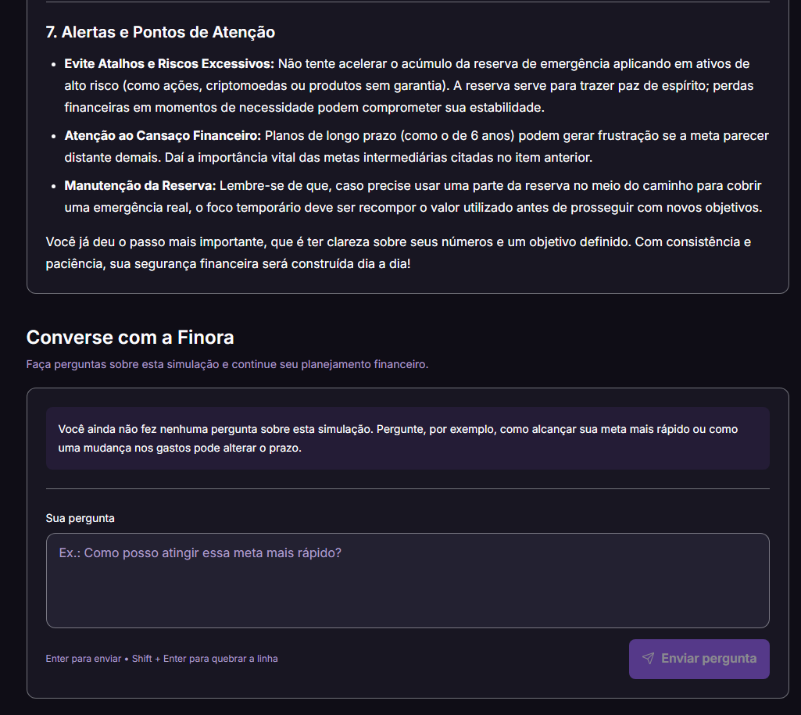
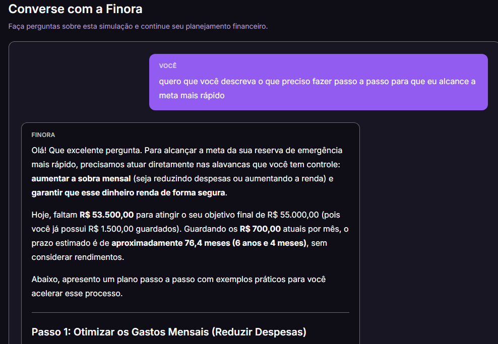
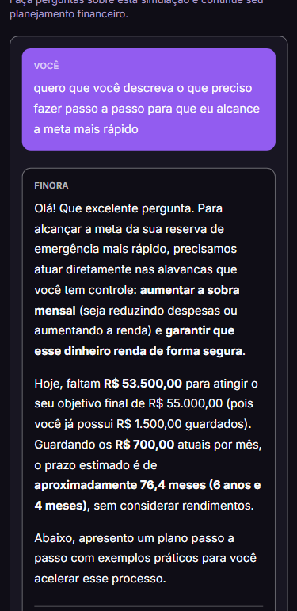

# Finora

### Educador Financeiro Inteligente

Aplicação web de planejamento financeiro que utiliza **Inteligência Artificial Generativa** para transformar dados financeiros em análises, orientações e conversas personalizadas.

<br>

**React • TypeScript • Vite • Tailwind CSS • Google Gemini**

</div>

---

## Sobre o projeto

A **Finora** é uma aplicação de planejamento financeiro pessoal criada para ajudar o usuário a compreender melhor sua situação financeira e visualizar caminhos para alcançar seus objetivos.

A experiência começa com uma simulação simples, na qual o usuário informa dados como:

- renda mensal;
- gastos mensais;
- reserva atual;
- objetivo financeiro;
- valor da meta.

A partir dessas informações, a aplicação utiliza **Inteligência Artificial Generativa** para produzir uma análise financeira personalizada.

As simulações ficam armazenadas no histórico e podem ser consultadas posteriormente. Dentro dos detalhes de cada simulação, o usuário também pode continuar conversando com a **Finora**, fazendo novas perguntas relacionadas ao seu planejamento.

O projeto foi desenvolvido como parte de um desafio prático da **Digital Innovation One (DIO)**, utilizando o projeto **Planej.ai** como base técnica e referência.

---

## Funcionalidades

- Formulário financeiro dividido em etapas
- Acompanhamento do progresso da simulação
- Campos monetários formatados
- Análise financeira utilizando IA Generativa
- Recomendações personalizadas
- Histórico de simulações
- Visualização dos detalhes de cada simulação
- Exclusão de simulações do histórico
- Conversa contextual com a Finora
- Manutenção do contexto durante a conversa
- Persistência das simulações e conversas no navegador
- Feedback visual durante respostas da IA
- Tratamento de erros
- Tema claro e escuro
- Layout responsivo para desktop e mobile

---

# Demonstração

## Nova simulação

A Finora conduz o usuário por um formulário em etapas para coletar as informações necessárias para o planejamento financeiro.

### ☀️ Tema claro



### 🌙 Tema escuro



<br>

## Resultado da simulação

Após concluir o formulário, os dados informados pelo usuário são organizados e utilizados como contexto para a geração da análise financeira.



<br>

## Histórico de simulações

As simulações realizadas ficam disponíveis no histórico.

Cada registro apresenta informações importantes como **objetivo financeiro, custo da meta, prazo estimado e economia mensal**.

O usuário também pode excluir uma simulação ou acessar seus detalhes.



<br>

## 🔎 Detalhes da simulação

Ao selecionar **Ver detalhes**, o usuário pode acessar novamente a simulação escolhida, consultar sua análise e continuar o planejamento.



<br>

## 💬 Converse com a Finora

Além da análise inicial, o usuário pode continuar conversando com a Finora sobre a simulação realizada.

A IA considera os dados financeiros e o contexto da conversa para gerar novas respostas.



<br>

## 📱 Experiência mobile

A aplicação também possui layout responsivo para dispositivos móveis.

<div align="center">



</div>

---

## Inteligência Artificial

A Finora utiliza a **API do Google Gemini** para gerar orientações financeiras personalizadas a partir dos dados fornecidos pelo usuário.

A integração possui dois fluxos principais.

### Análise inicial

Depois que a simulação é concluída:

```text
Dados financeiros
        ↓
Construção do prompt
        ↓
Google Gemini
        ↓
Análise personalizada
        ↓
Resultado da simulação
```

A análise pode considerar informações como:

- relação entre renda e gastos;
- capacidade mensal de economia;
- reserva financeira atual;
- objetivo informado;
- valor necessário para atingir a meta;
- possíveis pontos de atenção;
- sugestões de organização;
- próximos passos.

### Conversa contextual

Após receber a análise inicial, o usuário pode continuar fazendo perguntas sobre aquela simulação.

O contexto enviado para a IA considera:

```text
Dados da simulação
        +
Análise financeira
        +
Histórico da conversa
        +
Nova pergunta
        ↓
Google Gemini
        ↓
Resposta contextualizada
```

Dessa forma, cada pergunta não é tratada como uma interação completamente isolada.

---

## Experiência de conversa

O chat da Finora permite que o usuário continue explorando seu planejamento financeiro depois da análise inicial.

Entre os recursos implementados estão:

- múltiplas perguntas por simulação;
- histórico de perguntas e respostas;
- contexto financeiro da simulação;
- persistência da conversa;
- feedback enquanto a IA está respondendo;
- tratamento de erros;
- envio com `Enter`;
- quebra de linha com `Shift + Enter`;
- rolagem automática para novas mensagens;
- respostas formatadas em Markdown.

---

## Persistência dos dados

Atualmente, a Finora utiliza a **Web Storage API (`localStorage`)** para armazenar as informações no navegador.

Cada simulação pode conter:

```text
Simulação
│
├── ID
├── Data de criação
├── Renda mensal
├── Gastos mensais
├── Reserva atual
├── Objetivo financeiro
├── Valor da meta
├── Análise da IA
│
└── Histórico da conversa
    ├── Perguntas do usuário
    └── Respostas da Finora
```

Isso permite que o usuário atualize a página ou volte posteriormente e continue acessando suas simulações no mesmo navegador.

---

## Tecnologias utilizadas

### Front-end

- React
- TypeScript
- Vite
- Tailwind CSS
- React Router

### Inteligência Artificial

- Google Gemini API

### Interface e conteúdo

- Lucide React
- React Markdown
- remark-gfm

### Persistência

- Web Storage API (`localStorage`)

### Desenvolvimento

- pnpm
- ESLint
- Git
- GitHub

---

## Estrutura do projeto

```text
src/
│
├── components/
│
├── pages/
│   ├── SimulationFormPage.tsx
│   ├── SimulationResultPage.tsx
│   ├── SimulationHistoryPage.tsx
│   └── SimulationHistoryDetailsPage.tsx
│
├── services/
│   └── ai/
│       ├── buildFinancialPrompt.ts
│       ├── buildChatPrompt.ts
│       └── gemini.ts
│
├── types/
│   └── Simulation.ts
│
└── router.tsx
```

A lógica relacionada à Inteligência Artificial foi separada da interface, mantendo a construção dos prompts e a comunicação com o Gemini dentro da camada `services/ai`.

---

## Como executar

### Pré-requisitos

Antes de começar, tenha instalado:

- Node.js
- pnpm
- Git

Também será necessária uma chave da API do Google Gemini.

### Instalação

Clone o repositório:

```bash
git clone https://github.com/stheclara/desafio-educador-financeiro-ia.git
```

Acesse a pasta:

```bash
cd desafio-educador-financeiro-ia
```

Instale as dependências:

```bash
pnpm install
```

Crie um arquivo `.env` na raiz do projeto seguindo o `.env.example`:

```env
VITE_GEMINI_API_KEY=sua_chave_aqui
```

Inicie o ambiente de desenvolvimento:

```bash
pnpm dev
```

---

## Variáveis de ambiente

A chave da API não deve ser enviada para o repositório.

Utilize o arquivo `.env.example` como referência:

```env
VITE_GEMINI_API_KEY=
```

> **Importante:** o arquivo `.env` deve permanecer no `.gitignore`.

Em uma aplicação de produção, a comunicação com serviços que dependem de credenciais privadas deve ser intermediada por um backend ou serviço apropriado.

---

## Validação

O projeto pode ser validado utilizando:

```bash
pnpm lint
```

e:

```bash
pnpm build
```

Durante o desenvolvimento, também foram realizados testes manuais dos principais fluxos da aplicação em diferentes tamanhos de tela.

---

### Histórico de Simulações

Foi implementado um histórico para permitir que o usuário:

- visualize suas simulações anteriores;
- consulte informações resumidas;
- exclua uma simulação;
- acesse os detalhes de uma simulação específica;
- recupere a análise anteriormente gerada.

### Conversando com o Educador Financeiro

A experiência foi expandida para permitir que o usuário continue conversando com a Finora depois da análise inicial.

Foram implementados:

- campo para novas perguntas;
- respostas geradas por IA;
- contexto da simulação;
- histórico da conversa;
- persistência no `localStorage`;
- feedback de carregamento;
- tratamento de erros;
- múltiplas perguntas dentro da mesma simulação.

---

## Possíveis evoluções

Algumas melhorias que podem ser implementadas futuramente:

- autenticação de usuários;
- backend próprio;
- banco de dados;
- sincronização entre dispositivos;
- gráficos financeiros;
- comparação entre diferentes cenários;
- edição de simulações;
- exportação de relatórios;
- testes automatizados;
- melhorias adicionais de acessibilidade.

---

## Sobre o desafio

Projeto desenvolvido como parte de um desafio prático da **Digital Innovation One (DIO)**.

A solução utiliza o **Planej.ai** como base técnica e referência e expande a experiência com histórico de simulações, recuperação de análises e interação contextual com Inteligência Artificial.

---

<div align="center">

## Finora

**Planeje. Entenda. Evolua.**

Desenvolvido por **Sthefanie**

</div>